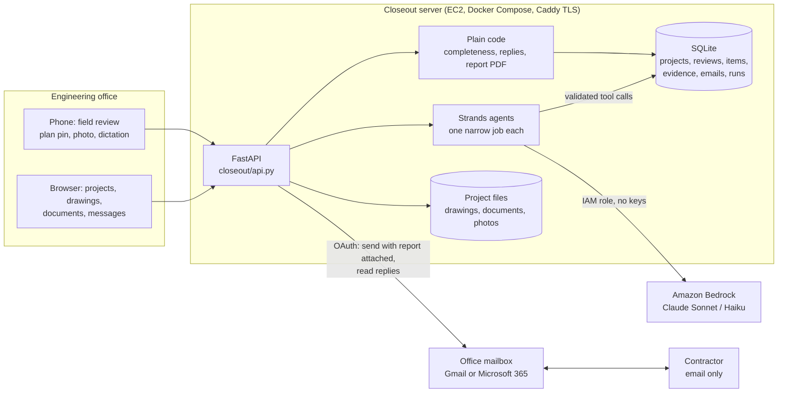

# Closeout

Closeout keeps a building project in one place for the engineering office that reviews it: the drawings, the
documents, the field reviews, and the back-and-forth with the contractor until each deficiency is closed.

Built for the AWS **Agents for Humans Hackathon** (Professional Agents track) on the
[Strands Agents SDK](https://strandsagents.com), with Claude on Amazon Bedrock.

## The problem

An electrical or architectural engineer walks a site, finds deficiencies, and writes them up. Then the real work
starts: a report goes to the contractor, photos come back by email days later with "done" in the subject, and
someone in the office has to work out which photo answers which item, what is still missing, and whether the
drawing set they walked with was even the current one. That work lives in inboxes, folders and spreadsheets.

Closeout does the reading and the filing. The engineer still makes every call.

## What it does

**Project folder.** Upload the project as one zip. Closeout reads every file, files drawings and documents by
building and discipline, keeps older issues of a set apart from the current one, and lists the documents still
needed before occupancy (for example letters of assurance) as checklists. Every move it makes is marked as its own
and can be undone; the office can make its own folders and move files by hand.

**Drawings.** Each sheet is read once: its title, discipline, the units and floors it shows. Plans are matched to
buildings, units and floors so the field review opens on the right sheet. On request, Closeout reads the set and
lists what to check on site and what to ask the designer.

**Field review on a phone.** Open the plan for your floor, tap the spot, add a photo if you want one, type or
dictate what is wrong. Closeout can tidy the wording into a deficiency with its location and what the contractor
must send to close it. Items are numbered per discipline (`EL-01`, `AR-03`) and pinned to the plan.

**Finish and send.** Finishing a review confirms which review and walk it was, which units were walked, and who
gets the report. Closeout writes the covering email; the PDF report (every deficiency, its photo and its plan
pin) is attached. It waits as a draft until the engineer presses Send, from the office's own Gmail or
Microsoft 365 mailbox.

**Replies.** Closeout reads the office mailbox for replies in that thread, or new emails carrying the review's
reference (`CO-XXXXXX`) in the subject. Each photo or document is matched to the item it answers. A reply that
says "done" with no photo is shown for what it is: the words alone do not close an item that asked for a photo.

**The engineer decides.** Each item shows what was asked for, what came in, and what is still missing. The
engineer marks it ready to close, on hold, or not accepted, and can email that back to the contractor.

**Ask.** Ask about the project in plain words, typed or spoken ("what does the contractor still need to send?").
Closeout answers from the project's records and can prepare a change, such as finishing a review, for the
engineer to confirm.

## What it never does

- It never says work is acceptable, compliant, approved or closed. Those words are refused at the tool boundary
  and the model is told why, so it can rewrite.
- It never sends an email on its own. Every email waits for the engineer's Send.
- It never picks one item when a photo fits two; the photo stays with the engineer to place.
- It never guesses a location that is not on the file, the plan pin, or the contractor's note.
- Whether an item has everything it asked for is decided by plain code over the recorded evidence, not by the model.

## How Strands is used

Closeout is not one long-running chat. Each job is a small Strands `Agent` with a narrow set of tools that write
structured records, and the tools validate every call before it counts. A rejected call returns the reason, and
the agent corrects itself within the same job.

| Job | Where | Tools the agent gets | What the tools check |
|---|---|---|---|
| Read one drawing sheet | `closeout/project.py` | `record_sheet` | discipline, sheet kind, units and floors from the known set |
| Summarise the project | `closeout/project.py` | `record_project` | buildings and units match the sheets read |
| File the folder, find missing documents | `closeout/documents.py` | `record_file`, `record_missing`, `record_on_file`, `record_question`, `record_summary` | file, building and discipline must exist; no duplicates |
| Match plans to units and floors | `closeout/plans.py` | `record_plan` | floor and unit must be ones the set names |
| Read the set before the walk | `closeout/drawings.py` | `record_finding`, `record_gap`, `record_sheet_summary`, `record_set_summary` | finding kinds are fixed: check on site, ask the designer, note |
| Write up a deficiency from a pin and photo | `closeout/review.py` | `record_field_note` | unit, floor and item ids from the project only |
| Write the email to the contractor | `closeout/review.py` | `record_message` | every item in the report is mentioned; banned words refused |
| Match a returned photo or document to an item | `closeout/agent.py` | `inspect_evidence`, `get_deficiency`, `record_finding` | match tier, evidence slot, provenance, location rules |
| Answer a question, prepare a change | `closeout/ask.py` | `list_items`, `item`, `documents`, `answer`, `propose` | read-only; `propose` only prepares, the engineer confirms |

Models are set in the environment (`CLOSEOUT_MODEL_ID`, `CLOSEOUT_FAST_MODEL_ID`): Claude Sonnet on Bedrock for
reading and writing, Claude Haiku for quick answers. Every job is recorded with its token usage.

The spoken conversation in Ask uses OpenAI's realtime voice model only as ears and mouth: it hands each question
to the Strands Ask agent and reads back that agent's answer. Typed questions do not use it.

## Architecture



The server runs on an EC2 instance whose IAM role allows Bedrock model calls only; there are no AWS keys in the
app. Mailbox sign-in uses Google and Microsoft OAuth; tokens stay in the server's database and are never logged.

## Try it

- **Judges' copy:** <https://try.closeout.getcrewbrew.com>. The code is in the Devpost testing instructions. It holds
  two made-up projects, 418 Alder Court and Cedar Row Townhomes, with their drawings already filed, and nothing from
  the office's real work. No mailbox is connected, so the send button opens the email in your own mail app.
- **Upload a project yourself:** download [`samples/Alder Court.zip`](samples/Alder%20Court.zip) (made-up drawings,
  a permit and a letter of assurance) and choose *Upload the project zip* on the Projects page. Closeout files the
  drawings. After that you do not need to add more files for the walk or the report. Give the first read a few minutes.
- **Field review:** open a project, then *Field review*. The plan opens as a clean outline (measurements and pipe
  clutter stripped). Toggle the original drawing or the electrical design layer. Tap a spot: a **deficiency** (for
  the contractor) or an **observation** (for the record). Pins stay on the same coordinates either way.
- **Filtered report:** on Field review, pick a building and floor, edit the suggested comments, optionally add an
  email and a project link, then *Save to Field reviews folder*. Company name and logo (Office page) print at the
  top with the inspector signature block underneath. History of earlier saves for that building/floor is offered.
  An email, if entered, is a draft only — the engineer still presses Send.

## Run it locally

```bash
python3.13 -m venv .venv && .venv/bin/pip3 install -r requirements.txt
cp .env.example .env        # Bedrock by default; uses the AWS credentials in your environment
.venv/bin/python -m uvicorn closeout.api:app --port 8765
```

Open <http://localhost:8765/> and create a project from a zip of drawings and documents. Data lands in `data/`,
which is gitignored. PDF sheet renders (and therefore outlines) need `pdftoppm` from poppler; without it the zip
still files, but plan images will be missing.

**Smoke path (no Bedrock):** zip → drawings on file → field review with outline + a deficiency and an observation →
filtered report saved under `{discipline}/Field reviews/` with company header, signature block, history, and an
email draft that is not sent.

```bash
.venv/bin/python -m pytest -q tests/test_outline.py tests/test_report.py tests/test_documents.py tests/test_review.py tests/test_folders.py
```

Tests (model calls are faked; tests that need Bedrock are skipped without credentials):

```bash
.venv/bin/python -m pytest -q
```

Deployment files are in `deploy/` (Dockerfile, Docker Compose with Caddy, server setup). Settings go in
`deploy/.env`, copied from `deploy/env.example`; it is gitignored.

## Sample data

Everything in `samples/` is synthetic. The photos in `samples/evidence/batch-01` are placeholders drawn by
`scripts/make_placeholder_evidence.py`. Company names, people and projects are invented.

## Disclosure

This repository was created during the hackathon submission period. The author works at an engineering
consultancy and has built unrelated field-review software before; no code from those projects is used here.
The Strands Agents SDK and the packages in `requirements.txt` are third-party.

License: MIT.
